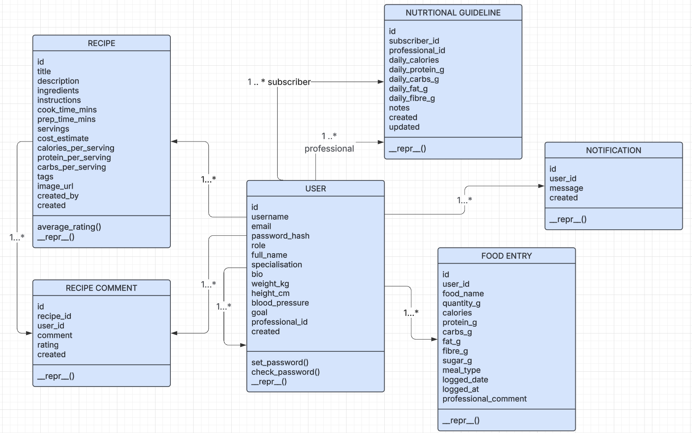
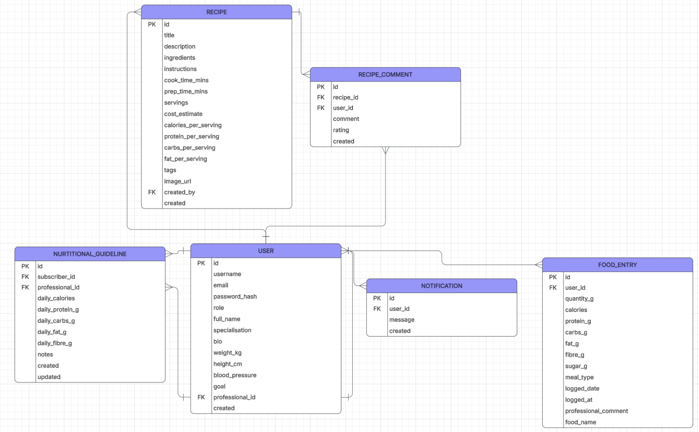

Overall we needed to remove many features as well as readjust a lot of our priorities. Many of the initial wireframes were very cluttered and the initial design for the system, both for classes and for webpages were a mess.

Work completed:

Created Microsoft Word Sharepoint for documenting development process.

Created an Entity relationship Diagram for the project (this was abandoned)

Switched programming language to python and chose Flask as module of choice for web development due to lack of profieciency in Kotlin or Ktor in group.

Tested out web development in Flask and made basic webpage (simply for testing purposes; the webpage had nothing to do with the actual project)

Removed features from design:
Raising an issue as a client is unnecessary and the process of getting a professional should be streamlined.

A messaging service between clients and professionals would not work in reality. This is simply a matter of healthcare professionals in the UK being to busy to deal with constantly messaging clients.

Users should not start at the client home page when first using the app. That is just silly as users must sign in first.

Any automatic feedback on a user's diet would cause many issues. For one, it could take lots of strenous testing to fine tune a system that could accurately give a user proper medical advice and if the system doesn't give proper advice, it could harm people. This is because people can often have an unjustifiable trust towards computers. It is best that advice is left to professionals, who are properly qualified to give out advice.

Added features to design:

One way method for professoinals to communicate with clients. So that busy healthcare professionals can still provide guidance as set out in the project specification as well as in Job Story 1 without overloading them.

Rework for client home page so that it is less cluttered, with features lined up at top of page and the data visualisation front and centre of the home page. This gives 'clear feedback to subscribers that helps them improve their diet' as set out in the project specification.

New class diagram:

New Entity Relationship Diagram:

New terminal tests:

Test 12 (edited): Professionals must have a way to communicate with clients.

Test 15: WebApp must allow for viewing Food diary by day and allowing for user to view previous days.

Test 16: User must be able to go back to their home page by clicking a home page that is at the top left corner of the screen constantly.

New Wireframes:

Login page( which will be the new starting webpage when you first use the app)

Create account page( now has option to confirm password)

Client home page(Complete rework. Bar chart of calories over past week is centre of home page. All features are lined up at the top of the page.)

Food diary design hadn't been finalised until after week 2. It is inspired by MyFitnessPal's home page

Method for logging food in said diary. Uses API to find foods.

Total rework for searching for recipes page to make it less cluttered with only title, brief description and cost/calories per serving

New page for creating a recipe

View Recipe page( Total rework, page will scroll down instead of having new pages. Comments and reviews are simply at the bottom of the page instead of being their own pages)

Register as professional (total rework, cutting down on large amounts of unecessary information so register page is less cluttered)

Professional home page (complete rework, client list is first thing you see, other options are along top of webpage similar to clients)

Find clients (Raising issue feature has been completely removed so lients will simply request any professional who can accept their request)

